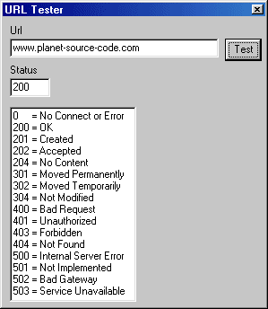



## URL Tester using API

### Description

Check for HTTP status without Inet Control using simple Api. Test if a Webpage/Server is still there or not.
 
### More Info
 

             |
---                |---
**Submitted On**   |2003-07-26 14:01:02
**By**             |[Scythe](https://github.com/Planet-Source-Code/PSCIndex/blob/master/ByAuthor/scythe.md)
**Level**          |Intermediate
**User Rating**    |5.0 (30 globes from 6 users)
**Compatibility**  |VB 5\.0, VB 6\.0
**Category**       |[Internet/ HTML](https://github.com/Planet-Source-Code/PSCIndex/blob/master/ByCategory/internet-html__1-34.md)
**World**          |[Visual Basic](https://github.com/Planet-Source-Code/PSCIndex/blob/master/ByWorld/visual-basic.md)
**Archive File**   |[URL\_Tester1620437262003\.zip](https://github.com/Planet-Source-Code/scythe-url-tester-using-api__1-47185/archive/master.zip)

